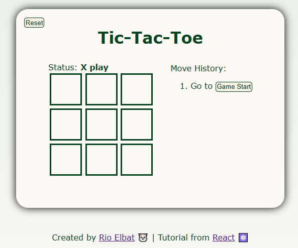

# TicTacToe

<p align="center">
  
</p>

## Description

This is a simple TicTacToe react based application. I built this while i was learning React library from [beta.reactjs.org](https://beta.reactjs.org/learn/).tutorial-tic-tac-toe#adding-time-travel.

## Features

- Tictactoe board
- Status game
- Move history
- Reset game

## Stacks

- `React v18.2.0`
- `Vite v4.1.0`

## How to run it

1. Clone it with this command on your terminal.

```
git clone https://github.com/rioelbat/my-tictactoe.git
```

2. Open `my-tictactoe`

3. Install the dependecies

```
npm install
```

4. Run the application in dev environtment

```
npm run dev
```
